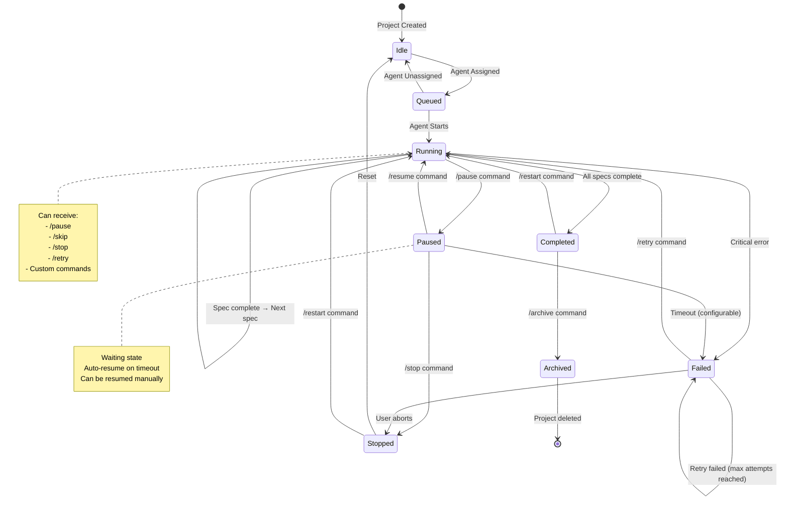

# Phase 5: Mission Control Interface Design

**Status:** Design Complete - Ready for Implementation
**Date:** 2026-01-30
**Phase:** 5 of 5 (Production Automation)
**Dependencies:** Phases 1-4 must be complete

---

## Executive Summary

**Mission Control** is the unified command and control interface for the Ralph Monitoring Dashboard. It goes far beyond simple start/pause controls, providing comprehensive project portfolio management with full command capabilities, bulk operations, agent assignment, and complete state tracking.

**Key Philosophy:** "Mission Control for your autonomous agent fleet" - like NASA Mission Control, but for AI agents managing multiple projects simultaneously.

---

## Table of Contents

1. [UI Layout & Dashboard Design](#ui-layout--dashboard-design)
2. [Per-Project Controls](#per-project-controls)
3. [Command Sending System](#command-sending-system)
4. [Bulk Operations](#bulk-operations)
5. [Command History](#command-history)
6. [Agent Management](#agent-management)
7. [Project State Machine](#project-state-machine)
8. [API Endpoint Design](#api-endpoint-design)
9. [Integration Architecture](#integration-architecture)
10. [Implementation Roadmap](#implementation-roadmap)

---

## 1. UI Layout & Dashboard Design

### 1.1 Main Mission Control Dashboard

```
┌─────────────────────────────────────────────────────────────────────────────────┐
│  🚀 Mission Control                                         [Ralph] [Claude] [All]│
├─────────────────────────────────────────────────────────────────────────────────┤
│  Connection: ● Live (WebSocket)  |  Mode: Real-time  |  Last Update: 2s ago   │
│  ┌──────────────────────────────────────────────────────────────────────────┐  │
│  │  Filter: [All Projects] [Running] [Paused] [Completed] [Failed]       │  │
│  │  Sort: [Name ▼] [Status] [Progress] [Agent] [Last Activity]          │  │
│  │  Search: [━━━━━━━━━━━━━━━━━]                                           │  │
│  │                                                                          │  │
│  │  ┌────────────────────────────────────────────────────────────────────┐ │  │
│  │  │ nonprofit-matcher                              Ralph    Running │ │  │
│  │  │ ━━━━━━━━━━━━━━━━━━━━━━━━━━━━━━━━━━━━━━━━━━━━━━━━━━━━━━━━━━━━━━━━━ │ │  │
│  │  │ Progress: 3/11 specs (27%)  |  Current: CR-02-typography (67%)   │ │  │
│  │  │ Agent: Ralph (gemini-2.5-flash)  |  Started: 2h 34m ago          │ │  │
│  │  │ ┌──────────────────────────────────────────────────────────────┐ │ │  │
│  │  │ │ [⏸ Pause] [▶ Resume] [⏭ Skip] [⏹ Stop] [📊 Details] [⋮]    │ │ │  │
│  │  │ └──────────────────────────────────────────────────────────────┘ │ │  │
│  │  └────────────────────────────────────────────────────────────────────┘ │  │
│  │                                                                          │  │
│  │  ┌────────────────────────────────────────────────────────────────────┐ │  │
│  │  │ project-alpha-prototype                         Claude    Paused │ │  │
│  │  │ ━━━━━━━━━━━━━━━━━━━━━━━━━━━━━━━━━━━━━━━━━━━━━━━━━━━━━━━━━━━━━━━━━ │ │  │
│  │  │ Progress: 8/15 specs (53%)  |  Paused at: CR-08-api-integration  │ │  │
│  │  │ Agent: Claude (claude-opus-4.5)  |  Paused: 45m ago              │ │  │
│  │  │ ┌──────────────────────────────────────────────────────────────┐ │ │  │
│  │  │ │ [▶ Resume] [⏭ Skip] [🔄 Restart] [📊 Details] [⋮]          │ │ │  │
│  │  │ └──────────────────────────────────────────────────────────────┘ │ │  │
│  │  └────────────────────────────────────────────────────────────────────┘ │  │
│  │                                                                          │  │
│  │  ┌────────────────────────────────────────────────────────────────────┐ │  │
│  │  │ api-gateway-refactor                            Cursor    Failed │ │  │
│  │  │ ━━━━━━━━━━━━━━━━━━━━━━━━━━━━━━━━━━━━━━━━━━━━━━━━━━━━━━━━━━━━━━━━━ │ │  │
│  │  │ Progress: 2/7 specs (29%)  |  Failed: CR-03-auth-middleware      │ │  │
│  │  │ Agent: Cursor (agent-x)  |  Failed: 1h 12m ago                   │ │  │
│  │  │ Error: Authentication middleware tests failed (3/10 tests)        │ │  │
│  │  │ ┌──────────────────────────────────────────────────────────────┐ │ │  │
│  │  │ │ [▶ Resume] [🔄 Retry] [🔍 Logs] [🐛 Debug] [📊 Details] [⋮]│ │ │  │
│  │  │ └──────────────────────────────────────────────────────────────┘ │ │  │
│  │  └────────────────────────────────────────────────────────────────────┘ │  │
│  │                                                                          │  │
│  │  ┌────────────────────────────────────────────────────────────────────┐ │  │
│  │  │ dashboard-analytics                             Ralph    Complete│ │  │
│  │  │ ━━━━━━━━━━━━━━━━━━━━━━━━━━━━━━━━━━━━━━━━━━━━━━━━━━━━━━━━━━━━━━━━━ │ │  │
│  │  │ Progress: 11/11 specs (100%)  |  Duration: 3h 24m                │ │  │
│  │  │ Agent: Ralph (gemini-2.5-flash)  |  Completed: Yesterday         │ │  │
│  │  │ Cost: $0.47  |  Success Rate: 91% (10/11 specs)                   │ │  │
│  │  │ ┌──────────────────────────────────────────────────────────────┐ │ │  │
│  │  │ │ [🔄 Rebuild] [📄 Report] [🗑️ Archive] [📊 Details] [⋮]      │ │ │  │
│  │  │ └──────────────────────────────────────────────────────────────┘ │ │  │
│  │  └────────────────────────────────────────────────────────────────────┘ │  │
│  └──────────────────────────────────────────────────────────────────────────┘  │
│                                                                                │
│  ┌──────────────────────────────────────────────────────────────────────────┐  │
│  │ Bulk Actions (0 selected)                                                │  │
│  │ [☑ Select All]  [⏸ Pause Selected]  [▶ Resume Selected]               │  │
│  │ [⏹ Stop Selected]  [🔄 Reassign Agent]  [📊 Compare Selected]        │  │
│  └──────────────────────────────────────────────────────────────────────────┘  │
│                                                                                │
│  ┌──────────────────────────────────────────────────────────────────────────┐  │
│  │ Quick Command (Ctrl+K)                                                   │  │
│  │ > [_] Type command, skill name, or search projects...                   │  │
│  └──────────────────────────────────────────────────────────────────────────┘  │
│                                                                                │
│  [📊 Portfolio Analytics]  [⚙️ Settings]  [📜 Command History]  [🔔 Notifications]│
└─────────────────────────────────────────────────────────────────────────────────┘
```

### 1.2 Project Details Panel (Click [📊 Details])

```
┌─────────────────────────────────────────────────────────────────────────────────┐
│  nonprofit-matcher - Project Details                            [✕ Close]     │
├─────────────────────────────────────────────────────────────────────────────────┤
│  ┌─────────────────────────────┬──────────────────────────────────────────┐   │
│  │  Overview                   │  Real-Time Progress                      │   │
│  │  ┌───────────────────────┐  │  ┌────────────────────────────────────┐ │   │
│  │  │ Status: Running       │  │  │ ████████░░░░ 3/11 specs (27%)     │ │ │   │
│  │  │ Agent: Ralph          │  │  │ ETA: ~45 minutes                   │ │ │   │
│  │  │ Model: gemini-2.5-flash│  │  │ Current: CR-02-typography         │ │ │   │
│  │  │ Started: 2h 34m ago   │  │  │ Phase: Running E2E tests...        │ │ │   │
│  │  │ Cost: $0.14 / ~$0.50  │  │  └────────────────────────────────────┘ │   │
│  │  │ Tokens: 45,231        │  │                                          │   │
│  │  └───────────────────────┘  │  Spec Timeline:                          │   │
│  │                             │  [✓ CR-01] [→ CR-02] [  CR-03] [  CR-04]│   │
│  │  Current Spec:               │                                          │   │
│  │  ┌───────────────────────┐  │  Live Logs:                              │   │
│  │  │ CR-02-typography      │  │  ┌────────────────────────────────────┐ │   │
│  │  │ Status: In Progress   │  │  │ [23:14:42] Running E2E tests...    │ │ │   │
│  │  │ Attempt: 2/3          │  │  │ [23:14:49] ❌ E2E tests failed      │ │ │   │
│  │  │ Phase: Testing        │  │  │ [23:15:46] CR created: CR-fix...    │ │ │   │
│  │  │ Duration: 3m 14s      │  │  │ [23:16:02] Retrying with fix...     │ │ │   │
│  │  └───────────────────────┘  │  └────────────────────────────────────┘ │   │
│  └─────────────────────────────┴──────────────────────────────────────────┘   │
│                                                                                │
│  ┌──────────────────────────────────────────────────────────────────────────┐  │
│  │ Command Center                                                            │  │
│  │ ┌─────────────────┬─────────────────┬─────────────────┬────────────────┐│  │
│  │ │ ⏸ Pause         │ ▶ Resume        │ ⏭ Skip Current  │ ⏹ Stop        ││  │
│  │ └─────────────────┴─────────────────┴─────────────────┴────────────────┘│  │
│  │ ┌─────────────────┬─────────────────┬─────────────────┬────────────────┐│  │
│  │ │ 🔄 Retry Spec    │ 🔍 View Logs    │ 🐛 Debug Mode    │ 📊 Analytics  ││  │
│  │ └─────────────────┴─────────────────┴─────────────────┴────────────────┘│  │
│  └──────────────────────────────────────────────────────────────────────────┘  │
│                                                                                │
│  ┌──────────────────────────────────────────────────────────────────────────┐  │
│  │ Custom Command                                                             │  │
│  │ ┌──────────────────────────────────────────────────────────────────────┐ │  │
│  │ │ Send custom command to Ralph...                                       │ │  │
│  │ │                                                                        │ │  │
│  │ │ Auto-send in: 15s (typing resets timer)              [Send] [Cancel] │ │  │
│  │ └──────────────────────────────────────────────────────────────────────┘ │  │
│  └──────────────────────────────────────────────────────────────────────────┘  │
│                                                                                │
│  ┌──────────────────────────────────────────────────────────────────────────┐  │
│  │ Agent Assignment                                                           │  │
│  │  Current Agent: Ralph (gemini-2.5-flash)                                  │  │
│  │  Change Agent: [Ralph ▼] [Claude] [Cursor] [Terminal]                     │  │
│  │  Model: [gemini-2.5-flash ▼] [claude-opus-4.5] [agent-x]                 │  │
│  │                    [Reassign]                                             │  │
│  └──────────────────────────────────────────────────────────────────────────┘  │
│                                                                                │
│  ┌──────────────────────────────────────────────────────────────────────────┐  │
│  │ Spec History (Last 5)                                                     │  │
│  │  ✓ CR-01-setup (completed) - 2m 34s - $0.02                              │  │
│  │  → CR-02-typography (in progress) - 3m 14s - $0.04                       │  │
│  │    CR-03-components (pending)                                             │  │
│  │    CR-04-state-management (pending)                                      │  │
│  │    CR-05-routing (pending)                                                │  │
│  └──────────────────────────────────────────────────────────────────────────┘  │
└─────────────────────────────────────────────────────────────────────────────────┘
```

---

## 2. Per-Project Controls

### 2.1 Quick Actions (Always Visible)

| Button | Command | Description | Availability |
|--------|---------|-------------|--------------|
| ⏸ Pause | `/pause` | Pause execution at next safe point | Running projects |
| ▶ Resume | `/resume` | Continue from pause | Paused projects |
| ⏭ Skip | `/skip` | Skip current spec and move to next | Running projects |
| ⏹ Stop | `/stop` | Abort entire build | Running/Paused projects |
| 🔄 Retry | `/retry <spec-id>` | Retry a failed spec | Failed projects |
| 🔄 Restart | `/restart` | Restart entire project from scratch | Completed/Failed projects |
| 🔍 Logs | `/logs` | Show full logs for current spec | All projects |
| 🐛 Debug | `/debug` | Enter debug mode (verbose logging) | Running/Failed projects |
| 📊 Analytics | `/analytics` | Open detailed analytics panel | All projects |
| 📄 Report | `/report` | Generate PDF/Markdown report | Completed projects |
| 🗑️ Archive | `/archive` | Archive completed project | Completed projects |

### 2.2 Advanced Controls (Dropdown Menu [⋮])

```
┌─────────────────────────────────────┐
│  Project Actions                    │
│  ───────────────────────────────────│
│  ⏸ Pause at Next Checkpoint        │
│  ⏭ Skip to Spec...                 │
│  ⏹ Stop After Current Spec         │
│  ───────────────────────────────────│
│  🔄 Retry Failed Specs              │
│  🔄 Retry from Spec...              │
│  ───────────────────────────────────│
│  🔍 View Full Logs                  │
│  🔍 View Error Summary              │
│  🐛 Enter Debug Mode                │
│  ───────────────────────────────────│
│  👤 Change Agent...                 │
│  ⚙️ Project Settings...             │
│  📤 Export Data (CSV/JSON)          │
│  ───────────────────────────────────│
│  📊 Compare with Other Runs         │
│  🔄 Duplicate Configuration         │
│  🗑️ Delete Project History         │
└─────────────────────────────────────┘
```

### 2.3 Context-Aware Actions

Actions change based on project state:

| State | Available Actions | Hidden/Disabled Actions |
|-------|-------------------|------------------------|
| **Running** | Pause, Skip, Stop, Logs, Debug | Resume, Retry, Restart |
| **Paused** | Resume, Skip, Stop, Restart | Pause, Retry |
| **Failed** | Retry, Debug, Logs, Restart | Pause, Resume, Skip |
| **Completed** | Restart, Report, Rebuild, Archive | Pause, Resume, Skip, Stop |
| **Waiting** (Agent assigned but idle) | Start, Reassign, Delete | Pause, Resume, Skip |

---

## 3. Command Sending System

### 3.1 Custom Command Interface

```
┌─────────────────────────────────────────────────────────────────────────────────┐
│  Custom Command Sender                                                         │
├─────────────────────────────────────────────────────────────────────────────────┤
│  Target Project: [nonprofit-matcher ▼]                                        │
│  Target Agent: [Ralph ▼]                                                      │
│                                                                                │
│  ┌──────────────────────────────────────────────────────────────────────────┐  │
│  │ Command Type:                                                              │  │
│  │ ○ Query (ask agent about itself)                                          │  │
│  │ ◉ Execution (send command to run)                                         │  │
│  │ ○ Skill Invocation (run specific skill)                                   │  │
│  │ ○ Natural Language (free-form instruction)                                │  │
│  └──────────────────────────────────────────────────────────────────────────┘  │
│                                                                                │
│  ┌──────────────────────────────────────────────────────────────────────────┐  │
│  │ Command:                                                                   │  │
│  │ ┌──────────────────────────────────────────────────────────────────────┐ │  │
│  │ │                                                                        │ │  │
│  │ │                                                                        │ │  │
│  │ │                                                                        │ │  │
│  │ └──────────────────────────────────────────────────────────────────────┘ │  │
│  │                                                                          │  │
│  │ Examples:                                                                │  │
│  │ • "Skip CR-02 and continue to CR-03"                                    │  │
│  │ • "design-check http://localhost:3000"                                  │  │
│  │ • "/retry CR-02"                                                        │  │
│  │ • "Run the full test suite and report results"                          │  │
│  └──────────────────────────────────────────────────────────────────────────┘  │
│                                                                                │
│  Timeout: [15──●──] seconds (0 = no timeout)                                   │
│                                                                                │
│  ┌──────────────────────────────────────────────────────────────────────────┐  │
│  │ Response Preview (real-time)                                              │  │
│  │ ┌──────────────────────────────────────────────────────────────────────┐ │  │
│  │ │                                                                        │ │  │
│  │ └──────────────────────────────────────────────────────────────────────┘ │  │
│  └──────────────────────────────────────────────────────────────────────────┘  │
│                                                                                │
│  [Send Command]  [Save as Macro]  [Clear]  [Cancel]                            │
└─────────────────────────────────────────────────────────────────────────────────┘
```

### 3.2 Command Templates

Pre-built commands for common operations:

```typescript
const commandTemplates = {
  // Spec Management
  skipToSpec: {
    name: "Skip to Spec",
    template: "/skip {currentSpec} && /start {targetSpec}",
    params: ["targetSpec"],
    description: "Skip current spec and start target spec"
  },

  retryFailed: {
    name: "Retry Failed Specs",
    template: "/retry --failed-only",
    description: "Retry all failed specs in current session"
  },

  changeModel: {
    name: "Change Model",
    template: "/set-model {model}",
    params: ["model"],
    description: "Switch to different model for remaining specs"
  },

  // Skills
  designCheck: {
    name: "Design Check",
    template: "design-check {url}",
    params: ["url"],
    description: "Run design-check skill on URL"
  },

  e2eTests: {
    name: "Run E2E Tests",
    template: "npm run test:e2e && /report-results",
    description: "Run full E2E test suite and report results"
  },

  // Queries
  tokenUsage: {
    name: "Token Usage",
    template: "/tokens --breakdown-by-spec",
    description: "Show detailed token usage by spec"
  },

  performanceReport: {
    name: "Performance Report",
    template: "/analytics --duration --cost --success-rate",
    description: "Generate performance analytics report"
  }
};
```

### 3.3 Command Syntax Reference

```
┌─────────────────────────────────────────────────────────────────────────────────┐
│  Command Syntax Reference                                        [✕ Close]     │
├─────────────────────────────────────────────────────────────────────────────────┤
│  Query Commands (ask agent about itself)                                       │
│  ┌──────────────────────────────────────────────────────────────────────────┐  │
│  │ /status                    → Show current status and progress             │  │
│  │ /tokens [options]          → Show token usage                             │  │
│  │   --breakdown-by-spec        Breakdown by spec                            │  │
│  │   --projected                Projected total cost                         │  │
│  │ /logs [spec-id]             → Show logs for spec                          │  │
│  │ /eta                       → Show estimated time remaining                │  │
│  │ /errors                     → Show error summary                          │  │
│  └──────────────────────────────────────────────────────────────────────────┘  │
│                                                                                │
│  Execution Commands (send command to run)                                      │
│  ┌──────────────────────────────────────────────────────────────────────────┐  │
│  │ /pause                     → Pause at next safe point                     │  │
│  │ /resume                    → Continue from pause                          │  │
│  │ /skip [spec-id]            → Skip current or specific spec                │  │
│  │ /stop                      → Abort entire build                           │  │
│  │ /retry [spec-id]           → Retry current or specific spec               │  │
│  │ /restart                   → Restart entire project from scratch          │  │
│  │ /set-model {model}          → Change model for remaining specs            │  │
│  └──────────────────────────────────────────────────────────────────────────┘  │
│                                                                                │
│  Skill Invocations (run specific skill)                                        │
│  ┌──────────────────────────────────────────────────────────────────────────┐  │
│  │ design-check {url}         → Run design-check skill on URL                │  │
│  │ e2e-test {suite}            → Run E2E test suite                          │  │
│  │ /commit [message]           → Trigger commit skill (Claude)               │  │
│  │ /review-pr {pr-number}      → Trigger PR review skill (Claude)            │  │
│  │ /refactor {file}            → Trigger refactor skill (Claude)             │  │
│  └──────────────────────────────────────────────────────────────────────────┘  │
│                                                                                │
│  Natural Language (free-form instructions)                                     │
│  ┌──────────────────────────────────────────────────────────────────────────┐  │
│  │ "Skip CR-02 and continue to CR-03"                                        │  │
│  │ "Run the full test suite and report results"                              │  │
│  │ "Change to gemini-2.5-flash model for remaining specs"                    │  │
│  │ "Debug why CR-02 is failing and show me the logs"                         │  │
│  └──────────────────────────────────────────────────────────────────────────┘  │
│                                                                                │
│  [Copy Command]  [Insert to Editor]  [Close]                                   │
└─────────────────────────────────────────────────────────────────────────────────┘
```

---

## 4. Bulk Operations

### 4.1 Multi-Select Interface

```
┌─────────────────────────────────────────────────────────────────────────────────┐
│  Mission Control - Bulk Operations                              [3 selected]   │
├─────────────────────────────────────────────────────────────────────────────────┤
│  Selected Projects:                                                             │
│  ☑ nonprofit-matcher (Running - Ralph)                                        │
│  ☑ project-alpha-prototype (Paused - Claude)                                  │
│  ☑ dashboard-analytics (Completed - Ralph)                                    │
│                                                                                │
│  ┌──────────────────────────────────────────────────────────────────────────┐  │
│  │ Bulk Actions                                                               │  │
│  │ ┌────────────────┬────────────────┬────────────────┬──────────────────┐ │  │
│  │ │ ⏸ Pause All    │ ▶ Resume All   │ ⏹ Stop All     │ 🔄 Restart All  │ │ │  │
│  │ └────────────────┴────────────────┴────────────────┴──────────────────┘ │  │
│  │ ┌────────────────┬────────────────┬────────────────┬──────────────────┐ │  │
│  │ │ 👤 Reassign     │ 📊 Compare      │ 📤 Export Data  │ 🗑️ Delete        │ │ │  │
│  │ └────────────────┴────────────────┴────────────────┴──────────────────┘ │  │
│  └──────────────────────────────────────────────────────────────────────────┘  │
│                                                                                │
│  ┌──────────────────────────────────────────────────────────────────────────┐  │
│  │ Reassignment Wizard                                                        │  │
│  │  Current Agent Distribution:                                              │  │
│  │  • Ralph: 2 projects                                                      │  │
│  │  • Claude: 1 project                                                      │  │
│  │  • Cursor: 0 projects                                                      │  │
│  │                                                                           │  │
│  │  New Agent Assignment:                                                    │  │
│  │  Target Agent: [Cursor ▼]                                                 │  │
│  │  Model: [agent-x ▼]                                                       │  │
│  │  Strategy: ○ Reassign all                                               │  │
│  │            ◉ Smart balance (distribute by priority)                     │  │
│  │            ○ Manual (select projects individually)                      │  │
│  │                                                                           │  │
│  │  Priority Order:                                                          │  │
│  │  1. nonprofit-matcher (high priority - running)                           │  │
│  │  2. project-alpha-prototype (medium priority - paused)                    │  │
│  │  3. dashboard-analytics (low priority - completed)                        │  │
│  │                                                                           │  │
│  │  [Preview Changes]  [Execute Reassignment]  [Cancel]                      │  │
│  └──────────────────────────────────────────────────────────────────────────┘  │
│                                                                                │
│  ┌──────────────────────────────────────────────────────────────────────────┐  │
│  │ Comparison Report                                                          │  │
│  │  ┌────────────────────────────────────────────────────────────────────┐  │  │
│  │  │ Metric                    | nonprofit-matcher | project-alpha |    │  │  │
│  │  │ ────────────────────────────────────────────────────────────────  │  │  │
│  │  │ Status                    | Running           | Paused         │    │  │  │
│  │  │ Progress                  | 3/11 (27%)        | 8/15 (53%)     │    │  │  │
│  │  │ Agent                     | Ralph             | Claude         │    │  │  │
│  │  │ Duration                  | 2h 34m            | 5h 12m         │    │  │  │
│  │  │ Cost                      | $0.14             | $0.32          │    │  │  │
│  │  │ Success Rate              | 91%               | 87%            │    │  │  │
│  │  └────────────────────────────────────────────────────────────────────┘  │  │
│  │  [Export Comparison (CSV)]  [Generate Visual Chart]  [Close]              │  │
│  └──────────────────────────────────────────────────────────────────────────┘  │
└─────────────────────────────────────────────────────────────────────────────────┘
```

### 4.2 Bulk Command Operations

Send the same command to multiple projects:

```
┌─────────────────────────────────────────────────────────────────────────────────┐
│  Bulk Command Sender                                              [3 selected]  │
├─────────────────────────────────────────────────────────────────────────────────┤
│  Selected Projects:                                                             │
│  ☑ nonprofit-matcher (Ralph)                                                  │
│  ☑ project-alpha-prototype (Claude)                                           │
│  ☑ api-gateway-refactor (Ralph)                                               │
│                                                                                │
│  ┌──────────────────────────────────────────────────────────────────────────┐  │
│  │ Command to Send:                                                           │  │
│  │ ┌──────────────────────────────────────────────────────────────────────┐ │  │
│  │ │ /pause                                                                 │ │  │
│  │ └──────────────────────────────────────────────────────────────────────┘ │  │
│  │                                                                          │  │
│  │ Execution Strategy:                                                      │  │
│  │ ◉ Parallel (send to all simultaneously)                                │  │
│  │ ○ Sequential (wait for each to complete)                               │  │
│  │ ○ Smart (adapt based on agent type)                                    │  │
│  └──────────────────────────────────────────────────────────────────────────┘  │
│                                                                                │
│  ┌──────────────────────────────────────────────────────────────────────────┐  │
│  │ Response Preview (real-time)                                              │  │
│  │ ┌──────────────────────────────────────────────────────────────────────┐ │  │
│  │ │ nonprofit-matcher: Paused at CR-02 (2/11 specs)                     │ │  │
│  │ │ project-alpha-prototype: Paused at CR-08 (8/15 specs)               │ │  │
│  │ │ api-gateway-refactor: Paused at CR-03 (2/7 specs)                  │ │  │
│  │ │                                                                        │ │  │
│  │ │ ✓ All 3 projects paused successfully                                  │ │  │
│  │ └──────────────────────────────────────────────────────────────────────┘ │  │
│  └──────────────────────────────────────────────────────────────────────────┘  │
│                                                                                │
│  [Send Command]  [Save as Macro]  [Clear]  [Cancel]                            │
└─────────────────────────────────────────────────────────────────────────────────┘
```

### 4.3 Bulk Export

Export data from multiple projects:

```typescript
interface BulkExportOptions {
  projects: string[];        // Selected project IDs
  format: 'csv' | 'json' | 'pdf';
  includeFields: {
    specHistory: boolean;
    commandHistory: boolean;
    analytics: boolean;
    errors: boolean;
    costData: boolean;
  };
  dateRange?: {
    start: Date;
    end: Date;
  };
  aggregateMetrics: boolean; // Combine all projects into summary
}
```

---

## 5. Command History

### 5.1 Command History Dashboard

```
┌─────────────────────────────────────────────────────────────────────────────────┐
│  Command History                                          [Filter] [Export]     │
├─────────────────────────────────────────────────────────────────────────────────┤
│  Filter: [All Projects] [All Agents] [All Commands] [All Time]              │  │
│  Search: [━━━━━━━━━━━━━━━━━]                                               │  │
│                                                                                │
│  ┌──────────────────────────────────────────────────────────────────────────┐  │
│  │ Time          │ Project             │ Agent │ Command       │ Status    │  │
│  │ ─────────────────────────────────────────────────────────────────────── │  │
│  │ 2m ago        │ nonprofit-matcher   │ Ralph │ /pause        │ ✓ Success│  │
│  │ 5m ago        │ project-alpha       │Claude │ design-check  │ ✓ Success│  │
│  │ 8m ago        │ api-gateway-refactor│ Ralph │ /retry CR-03  │ ✗ Failed │  │
│  │ 12m ago       │ nonprofit-matcher   │ Ralph │ /skip         │ ✓ Success│  │
│  │ 15m ago       │ dashboard-analytics │ Ralph │ /status       │ ✓ Success│  │
│  │ 18m ago       │ project-alpha       │Claude │ /commit       │ ✓ Success│  │
│  │ 22m ago       │ nonprofit-matcher   │ Ralph │ /logs CR-02   │ ✓ Success│  │
│  │ 25m ago       │ api-gateway-refactor│ Ralph │ /debug        │ ✓ Success│  │
│  │ 30m ago       │ project-alpha       │Claude │ /review-pr    │ ✓ Success│  │
│  │ 35m ago       │ nonprofit-matcher   │ Ralph │ /tokens       │ ✓ Success│  │
│  │ [Load More...]                                                              │  │
│  └──────────────────────────────────────────────────────────────────────────┘  │
│                                                                                │
│  ┌──────────────────────────────────────────────────────────────────────────┐  │
│  │ Command Details (click any row to view)                                  │  │
│  │ ┌──────────────────────────────────────────────────────────────────────┐ │  │
│  │ │ Command: /retry CR-03                                                │ │  │
│  │ │ Project: api-gateway-refactor                                        │ │  │
│  │ │ Agent: Ralph (gemini-2.5-flash)                                      │ │  │
│  │ │ Time: 2026-01-30 14:23:15 UTC                                        │ │  │
│  │ │                                                                      │ │  │
│  │ │ Input:                                                                │ │  │
│  │ │ POST /api/ralph/control                                              │ │  │
│  │ │ {                                                                    │ │  │
│  │ │   "action": "retry",                                                 │ │  │
│  │ │   "specId": "CR-03",                                                 │ │  │
│  │ │   "projectId": "api-gateway-refactor"                                │ │  │
│  │ │ }                                                                    │ │  │
│  │ │                                                                      │ │  │
│  │ │ Response:                                                             │ │  │
│  │ │ {                                                                    │ │  │
│  │ │   "status": "error",                                                 │ │  │
│  │ │   "error": "Spec CR-03 not found in current session",                │ │  │
│  │ │   "availableSpecs": ["CR-01", "CR-02"]                               │ │  │
│  │ │ }                                                                    │ │  │
│  │ │                                                                      │ │  │
│  │ │ [Retry Command]  [View in Context]  [Export]                         │ │  │
│  │ └──────────────────────────────────────────────────────────────────────┘ │  │
│  └──────────────────────────────────────────────────────────────────────────┘  │
│                                                                                │
│  Statistics:                                                                    │
│  Total Commands: 1,247  |  Success Rate: 94.2%  |  Most Used: /status (143)    │
└─────────────────────────────────────────────────────────────────────────────────┘
```

### 5.2 Command History API

```typescript
interface CommandHistoryEntry {
  id: string;
  timestamp: Date;
  projectId: string;
  projectName: string;
  agentType: 'ralph' | 'claude' | 'cursor' | 'terminal';
  agentModel: string;
  command: string;
  commandType: 'query' | 'execution' | 'skill' | 'natural-language';
  input: {
    method: 'api' | 'cli' | 'websocket' | 'bulk';
    userId?: string;
    sessionId: string;
  };
  response: {
    status: 'success' | 'error' | 'timeout';
    data?: any;
    error?: string;
    duration: number; // milliseconds
  };
  context: {
    projectState: string;
    currentSpec?: string;
    progress: string;
  };
}

// API Endpoints
GET  /api/command-history                    // List all commands
GET  /api/command-history/:id                // Get specific command
POST /api/command-history/retry/:id          // Retry a command
GET  /api/command-history/stats              // Usage statistics
GET  /api/command-history/export             // Export to CSV/JSON
```

---

## 6. Agent Management

### 6.1 Agent Assignment Interface

```
┌─────────────────────────────────────────────────────────────────────────────────┐
│  Agent Assignment Manager                                                       │
├─────────────────────────────────────────────────────────────────────────────────┤
│  Current Agent Fleet                                                            │
│  ┌──────────────────────────────────────────────────────────────────────────┐  │
│  │ Agent         │ Status  │ Projects │ Load │ Model(s)                     │  │
│  │ ─────────────────────────────────────────────────────────────────────── │  │
│  │ Ralph         │ Active  │ 3/5      │ 60%  │ gemini-2.5-flash (2)         │  │
│  │               │         │          │      │ gemini-2.5-pro (1)           │  │
│  │ ─────────────────────────────────────────────────────────────────────── │  │
│  │ Claude        │ Idle    │ 1/5      │ 20%  │ claude-opus-4.5 (1)          │  │
│  │               │         │          │      │                              │  │
│  │ ─────────────────────────────────────────────────────────────────────── │  │
│  │ Cursor        │ Active  │ 1/5      │ 20%  │ agent-x (1)                  │  │
│  │               │         │          │      │                              │  │
│  │ ─────────────────────────────────────────────────────────────────────── │  │
│  │ Terminal      │ Idle    │ 0/5      │ 0%   │ -                            │  │
│  └──────────────────────────────────────────────────────────────────────────┘  │
│                                                                                │
│  ┌──────────────────────────────────────────────────────────────────────────┐  │
│  │ Assign New Project                                                        │  │
│  │  Project: [nonprofit-matcher ▼]                                          │  │
│  │  Agent: [Ralph ▼]                                                        │  │
│  │  Model: [gemini-2.5-flash ▼]                                             │  │
│  │  Priority: [Medium ▼]                                                    │  │
│  │  Auto-start: ☑                                                           │  │
│  │                    [Assign]                                              │  │
│  └──────────────────────────────────────────────────────────────────────────┘  │
│                                                                                │
│  ┌──────────────────────────────────────────────────────────────────────────┐  │
│  │ Reassignment Wizard                                                        │  │
│  │  Step 1: Select Projects                                                  │  │
│  │  ☑ nonprofit-matcher (Ralph)                                             │  │
│  │  ☑ project-alpha (Claude)                                                │  │
│  │  ☐ api-gateway-refactor (Ralph)                                          │  │
│  │                                                                           │  │
│  │  Step 2: Choose Target Agent                                              │  │
│  │  Target: [Cursor ▼]                                                       │  │
│  │  Model: [agent-x ▼]                                                       │  │
│  │                                                                           │  │
│  │  Step 3: Reassignment Strategy                                            │  │
│  │  ◉ Smart balance (distribute by priority/load)                           │  │
│  │  ○ Round-robin (equal distribution)                                      │  │
│  │  ○ Manual (specify order)                                                │  │
│  │                                                                           │  │
│  │  Preview:                                                                 │  │
│  │  • nonprofit-matcher → Cursor (agent-x) [Priority: High]                 │  │
│  │  • project-alpha → Cursor (agent-x) [Priority: Medium]                  │  │
│  │                                                                           │  │
│  │  Warning: Cursor is currently at 20% load. After reassignment: 40%       │  │
│  │                                                                           │  │
│  │  [Back]  [Execute Reassignment]                                          │  │
│  └──────────────────────────────────────────────────────────────────────────┘  │
└─────────────────────────────────────────────────────────────────────────────────┘
```

### 6.2 Agent Pool Management

```typescript
interface AgentPool {
  agents: {
    [agentType: string]: AgentInstance;
  };
  projects: {
    [projectId: string]: ProjectAssignment;
  };
  loadBalancing: LoadBalancingStrategy;
}

interface AgentInstance {
  id: string;
  type: 'ralph' | 'claude' | 'cursor' | 'terminal';
  model: string;
  status: 'active' | 'idle' | 'offline' | 'maintenance';
  currentLoad: number; // 0-100
  maxCapacity: number; // max concurrent projects
  assignedProjects: string[];
  capabilities: string[]; // what this agent can do
}

interface ProjectAssignment {
  projectId: string;
  assignedAgent: string;
  assignedModel: string;
  priority: 'low' | 'medium' | 'high' | 'critical';
  status: 'queued' | 'running' | 'paused' | 'completed';
  assignedAt: Date;
}

type LoadBalancingStrategy =
  | 'round-robin'           // Equal distribution
  | 'priority-based'        // Higher priority projects first
  | 'load-aware'            // Assign to least loaded agent
  | 'capability-match'      // Match agent capabilities to project needs
  | 'manual';               // User specifies assignments
```

### 6.3 Agent Capability Matrix

| Agent | Models | Max Projects | Capabilities |
|-------|--------|--------------|--------------|
| **Ralph** | gemini-2.5-flash, gemini-2.5-pro | 5 | Spec orchestration, automated builds, test running |
| **Claude** | claude-opus-4.5, claude-sonnet-4.0 | 3 | Code review, debugging, natural language tasks, complex reasoning |
| **Cursor** | agent-x, agent-fast | 3 | File operations, IDE integration, refactoring |
| **Terminal** | - | 10 | Command execution, script running, build processes |

---

## 7. Project State Machine

### 7.1 State Transition Diagram

```
┌─────────────────────────────────────────────────────────────────────────────────┐
│  📊 API Quota Monitor                                              [Refresh]     │
├─────────────────────────────────────────────────────────────────────────────────┤
│  Global Status: ⚠️  Moderate Usage (78% of total quota)                          │
│                                                                                │
│  ┌──────────────────────────────────────────────────────────────────────────┐  │
│  │ Provider          │ Quota Type    │ Used    │ Limit    │ Reset        │  │
│  │ ─────────────────────────────────────────────────────────────────────── │  │
│  │ Claude API        │ Tokens/day    │ 847K    │ 1M      │ 4h 23m       │  │
│  │                   │ ━━━━━━━━━━━━━━━━━━━━━━ 84%                            │  │
│  │                   │ Requests/min  │ 45      │ 50      │ 12s           │  │
│  │                   │ ━━━━━━━━━━━━━━━━━━━━━━ 90% ⚠️                         │  │
│  │ ─────────────────────────────────────────────────────────────────────── │  │
│  │ OpenAI API        │ Tokens/day    │ 2.3M    │ 3M      │ 8h 15m        │  │
│  │                   │ ━━━━━━━━━━━━━━━━━━━━━━ 76%                            │  │
│  │ ─────────────────────────────────────────────────────────────────────── │  │
│  │ Gemini API        │ Requests/day  │ 1245    │ 1500    │ 2h 47m        │  │
│  │                   │ ━━━━━━━━━━━━━━━━━━━━━━ 83% ⚠️                         │  │
│  │ ─────────────────────────────────────────────────────────────────────── │  │
│  │ Cursor Agent API  │ Tokens/hr     │ 45K     │ 50K     │ 23m           │  │
│  │                   │ ━━━━━━━━━━━━━━━━━━━━━━ 90% ⚠️                         │  │
│  └──────────────────────────────────────────────────────────────────────────┘  │
│                                                                                │
│  ┌──────────────────────────────────────────────────────────────────────────┐  │
│  │ Alerts                                                                    │  │
│  │ ⚠️  [4x] Claude API: 90% requests/min limit - throttling active           │  │
│  │ ⚠️  [1x] Gemini API: 83% daily quota - consider pausing non-critical      │  │
│  │ ⚠️  [1x] Cursor API: 90% hourly quota - auto-pause in 5 min                │  │
│  │                   [Dismiss All] [View All Alerts]                          │  │
│  └──────────────────────────────────────────────────────────────────────────┘  │
│                                                                                │
│  ┌──────────────────────────────────────────────────────────────────────────┐  │
│  │ Per-Agent Usage                                                            │  │
│  │ ┌────────────────────────────────────────────────────────────────────┐   │  │
│  │ │ Agent         │ Provider  │ Tokens Used │ Hourly Rate │ Status     │   │  │
│  │ │ ─────────────────────────────────────────────────────────────────── │   │  │
│  │ │ ralph-main    │ Gemini   │ 452K        │ 52K/hr     │ 🟢 Normal  │   │  │
│  │ │ ralph-sec     │ Gemini   │ 389K        │ 48K/hr     │ 🟢 Normal  │   │  │
│  │ │ claude-1      │ Claude   │ 847K        │ 105K/hr    │ 🟡 Throttled│   │  │
│  │ │ cursor-dev    │ Cursor   │ 45K         │ 58K/hr     │ 🟡 Throttled│   │  │
│  │ └────────────────────────────────────────────────────────────────────┘   │  │
│  └──────────────────────────────────────────────────────────────────────────┘  │
│                                                                                │
│  ┌──────────────────────────────────────────────────────────────────────────┐  │
│  │ Auto-Pause Policy                                                          │  │
│  │ ☑ Enable auto-pause at 95% quota                                          │  │
│  │ ☑ Pause lowest priority projects first                                    │  │
│  │ ☑ Send notification before pausing                                        │  │
│  │ Alert threshold: [80%──●──95%]                                             │  │
│  │                                           [Save Policy]                   │  │
│  └──────────────────────────────────────────────────────────────────────────┘  │
│                                                                                │
│  [/quota] [Export CSV] [Configure Alerts] [View Historical Data]               │
└─────────────────────────────────────────────────────────────────────────────────┘
```

### 7.3 Rate Limit Detection

#### 7.3.1 Detection Methods

```typescript
interface RateLimitDetector {
  // Detect 429 errors
  detect429(response: any): boolean;

  // Detect rate limit headers
  detectRateLimitHeaders(response: any): RateLimitInfo;

  // Detect approaching limits
  detectApproachingLimit(usage: QuotaUsage): boolean;

  // Parse provider-specific rate limit headers
  parseRateLimitHeaders(provider: Provider, headers: Headers): RateLimitInfo;
}

interface RateLimitInfo {
  provider: Provider;
  limitType: 'requests' | 'tokens' | 'cost';
  current: number;
  limit: number;
  remaining: number;
  resetAt: Date;
  retryAfter?: number; // seconds
}

// Provider-specific implementations
class ClaudeRateLimitDetector implements RateLimitDetector {
  detect429(response: any): boolean {
    return response.status === 429 ||
           response.error?.type === 'rate_limit_error';
  }

  parseRateLimitHeaders(headers: Headers): RateLimitInfo {
    return {
      provider: 'claude',
      limitType: 'tokens',
      current: parseInt(headers.get('anthropic-ratelimit-tokens-used') || '0'),
      limit: parseInt(headers.get('anthropic-ratelimit-tokens-limit') || '0'),
      remaining: parseInt(headers.get('anthropic-ratelict-tokens-remaining') || '0'),
      resetAt: new Date(headers.get('anthropic-ratelimit-reset') || ''),
    };
  }
}

class GeminiRateLimitDetector implements RateLimitDetector {
  detect429(response: any): boolean {
    return response.status === 429 ||
           response.error?.code === 429;
  }

  parseRateLimitHeaders(headers: Headers): RateLimitInfo {
    // Gemini doesn't provide rate limit headers
    // Must track manually via request counting
    return this.getManualRateLimitInfo();
  }
}
```

#### 7.3.2 429 Error Handling

```typescript
class RateLimitHandler {
  async handleRequest(
    request: APIRequest,
    maxRetries: number = 5
  ): Promise<APIResponse> {
    let attempt = 0;

    while (attempt < maxRetries) {
      try {
        const response = await this.executeRequest(request);

        // Check for 429
        if (this.isRateLimited(response)) {
          attempt++;
          const retryAfter = this.getRetryAfter(response);

          // Exponential backoff
          const backoffDelay = this.calculateBackoff(attempt, retryAfter);

          console.log(`Rate limited, retrying in ${backoffDelay}ms (attempt ${attempt}/${maxRetries})`);

          await this.sleep(backoffDelay);
          continue;
        }

        // Update quota tracking
        await this.updateQuotaTracking(request, response);

        return response;
      } catch (error) {
        if (this.isRateLimitError(error)) {
          attempt++;
          const backoffDelay = this.calculateBackoff(attempt);
          await this.sleep(backoffDelay);
          continue;
        }
        throw error;
      }
    }

    throw new Error('Max retries exceeded for rate-limited request');
  }

  calculateBackoff(attempt: number, retryAfter?: number): number {
    if (retryAfter) {
      // Respect server's retry-after hint
      return retryAfter * 1000;
    }

    // Exponential backoff: 2^attempt seconds, with jitter
    const baseDelay = Math.pow(2, attempt) * 1000;
    const jitter = Math.random() * 1000;
    return baseDelay + jitter;
  }

  sleep(ms: number): Promise<void> {
    return new Promise(resolve => setTimeout(resolve, ms));
  }
}
```

### 7.4 Request Queue & Throttling

#### 7.4.1 Request Queue Architecture

```typescript
interface RequestQueue {
  enqueue(request: QueuedRequest): void;
  dequeue(): QueuedRequest | null;
  peek(): QueuedRequest | null;
  size(): number;
  clear(): void;
}

interface QueuedRequest extends APIRequest {
  id: string;
  priority: number; // Higher = more important
  queuedAt: Date;
  project: string;
  agent: string;
  timeout: number;
}

class PriorityRequestQueue implements RequestQueue {
  private queue: QueuedRequest[] = [];

  enqueue(request: QueuedRequest): void {
    this.queue.push(request);
    this.queue.sort((a, b) => b.priority - a.priority);
  }

  dequeue(): QueuedRequest | null {
    return this.queue.shift() || null;
  }

  peek(): QueuedRequest | null {
    return this.queue[0] || null;
  }

  size(): number {
    return this.queue.length;
  }

  clear(): void {
    this.queue = [];
  }
}
```

#### 7.4.2 Throttling Strategy

```typescript
class Throttler {
  private requestCounts: Map<string, number[]> = []; // provider -> timestamps
  private readonly windowMs: number = 60000; // 1 minute window
  private readonly limits: Map<string, number> = new Map();

  constructor() {
    // Configure limits per provider
    this.limits.set('claude', 50); // 50 requests/minute
    this.limits.set('gemini', 60);
    this.limits.set('openai', 100);
    this.limits.set('cursor', 30);
  }

  async throttleRequest(
    provider: string,
    request: () => Promise<any>
  ): Promise<any> {
    // Clean old requests outside the window
    this.cleanOldRequests(provider);

    // Check if we're at the limit
    const count = this.getRequestCount(provider);
    const limit = this.limits.get(provider) || 50;

    if (count >= limit) {
      // Wait until we can make the request
      const oldestRequest = this.getOldestRequest(provider);
      const waitTime = this.windowMs - (Date.now() - oldestRequest);

      console.log(`Throttling ${provider}: waiting ${waitTime}ms`);

      await this.sleep(waitTime);

      // Clean again after waiting
      this.cleanOldRequests(provider);
    }

    // Make the request
    const response = await request();

    // Track the request
    this.trackRequest(provider);

    return response;
  }

  private cleanOldRequests(provider: string): void {
    const now = Date.now();
    const requests = this.requestCounts.get(provider) || [];
    const validRequests = requests.filter(ts => now - ts < this.windowMs);
    this.requestCounts.set(provider, validRequests);
  }

  private getRequestCount(provider: string): number {
    return (this.requestCounts.get(provider) || []).length;
  }

  private trackRequest(provider: string): void {
    const requests = this.requestCounts.get(provider) || [];
    requests.push(Date.now());
    this.requestCounts.set(provider, requests);
  }

  private getOldestRequest(provider: string): number {
    const requests = this.requestCounts.get(provider) || [];
    return requests[0] || 0;
  }

  private sleep(ms: number): Promise<void> {
    return new Promise(resolve => setTimeout(resolve, ms));
  }
}
```

### 7.5 Auto-Pause & Quota Management

#### 7.5.1 Quota Thresholds

```typescript
interface QuotaThresholds {
  warning: number;    // 80% - Send alert
  critical: number;   // 90% - Throttle non-critical
  emergency: number;  // 95% - Auto-pause lowest priority
  maximum: number;    // 100% - Hard stop all
}

class QuotaManager {
  private thresholds: QuotaThresholds = {
    warning: 80,
    critical: 90,
    emergency: 95,
    maximum: 100
  };

  async checkQuotaAndAct(provider: string): Promise<void> {
    const usage = await this.getCurrentUsage(provider);
    const percentage = (usage.used / usage.limit) * 100;

    // Check thresholds
    if (percentage >= this.thresholds.maximum) {
      await this.handleMaximum(provider);
    } else if (percentage >= this.thresholds.emergency) {
      await this.handleEmergency(provider);
    } else if (percentage >= this.thresholds.critical) {
      await this.handleCritical(provider);
    } else if (percentage >= this.thresholds.warning) {
      await this.handleWarning(provider);
    }
  }

  private async handleWarning(provider: string): Promise<void> {
    // Send notification
    await this.sendAlert({
      level: 'warning',
      message: `${provider} quota at 80% - monitor closely`,
      provider
    });

    // Log to dashboard
    await this.logToDashboard({
      type: 'quota_warning',
      provider,
      message: 'Approaching rate limit'
    });
  }

  private async handleCritical(provider: string): Promise<void> {
    // Send urgent notification
    await this.sendAlert({
      level: 'critical',
      message: `${provider} quota at 90% - throttling initiated`,
      provider
    });

    // Throttle non-critical projects
    await this.throttleNonCriticalProjects(provider);

    // Update dashboard
    await this.logToDashboard({
      type: 'quota_critical',
      provider,
      message: 'Throttling non-critical work'
    });
  }

  private async handleEmergency(provider: string): Promise<void> {
    // Send emergency alert
    await this.sendAlert({
      level: 'emergency',
      message: `${provider} quota at 95% - pausing low-priority projects`,
      provider
    });

    // Pause lowest priority projects using this provider
    const pausedProjects = await this.pauseLowPriorityProjects(provider);

    // Notify user
    await this.sendNotification({
      title: `Paused ${pausedProjects.length} projects`,
      message: `${provider} quota critical. Paused: ${pausedProjects.join(', ')}`
    });

    // Update dashboard
    await this.logToDashboard({
      type: 'quota_emergency',
      provider,
      pausedProjects,
      message: 'Auto-paused to preserve quota'
    });
  }

  private async handleMaximum(provider: string): Promise<void> {
    // Hard stop ALL projects using this provider
    const allProjects = await this.getAllProjectsUsingProvider(provider);

    for (const project of allProjects) {
      await this.emergencyStop(project);
    }

    // Send alert
    await this.sendAlert({
      level: 'maximum',
      message: `${provider} quota exhausted - stopped all projects`,
      provider
    });
  }
}
```

#### 7.5.2 Priority-Based Pause Strategy

```typescript
interface ProjectPriority {
  projectId: string;
  priority: 'critical' | 'high' | 'medium' | 'low';
  quotaUsage: number; // tokens/hour
  canPause: boolean;
}

class PriorityBasedPause {
  async pauseLowPriorityProjects(provider: string): Promise<string[]> {
    // Get all projects using this provider
    const projects = await this.getProjectsByProvider(provider);

    // Sort by priority (lowest first) then by quota usage
    const sorted = projects.sort((a, b) => {
      const priorityOrder = { critical: 4, high: 3, medium: 2, low: 1 };
      if (priorityOrder[a.priority] !== priorityOrder[b.priority]) {
        return priorityOrder[a.priority] - priorityOrder[b.priority];
      }
      return b.quotaUsage - a.quotaUsage; // Higher usage paused first
    });

    // Pause projects until we're back under the threshold
    const pausedProjects: string[] = [];
    let quotaSaved = 0;
    const targetQuotaSave = await this.getQuotaSaveTarget(provider);

    for (const project of sorted) {
      if (quotaSaved >= targetQuotaSave) break;
      if (!project.canPause) continue;

      await this.pauseProject(project.projectId);
      pausedProjects.push(project.projectId);
      quotaSaved += project.quotaUsage;
    }

    return pausedProjects;
  }
}
```

### 7.6 `/quota` Command

```
┌─────────────────────────────────────────────────────────────────────────────────┐
│  /quota Usage Report                                                            │
├─────────────────────────────────────────────────────────────────────────────────┤
│                                                                                │
│  ┌──────────────────────────────────────────────────────────────────────────┐  │
│  │ Provider Summary                                                           │  │
│  │ ┌────────────────────────────────────────────────────────────────────┐   │  │
│  │ │ Provider    │ Quota Type  │ Used      │ Limit     │ %    │ Reset   │   │  │
│  │ │ ─────────────────────────────────────────────────────────────────── │   │  │
│  │ │ Claude      │ Tokens/day  │ 847,321   │ 1,000,000 │ 85%  │ 4h 23m │   │  │
│  │ │ Claude      │ Req/min     │ 47        │ 50        │ 94%  │ 12s    │   │  │
│  │ │ Gemini      │ Tokens/day  │ 1,245,000 │ 1,500,000 │ 83%  │ 2h 47m │   │  │
│  │ │ OpenAI      │ Tokens/day  │ 2,340,000 │ 3,000,000 │ 78%  │ 8h 15m │   │  │
│  │ │ Cursor      │ Tokens/hr   │ 47,500    │ 50,000    │ 95%  │ 23m    │   │  │
│  │ └────────────────────────────────────────────────────────────────────┘   │  │
│  └──────────────────────────────────────────────────────────────────────────┘  │
│                                                                                │
│  ┌──────────────────────────────────────────────────────────────────────────┐  │
│  │ Per-Project Breakdown                                                      │  │
│  │ ┌────────────────────────────────────────────────────────────────────┐   │  │
│  │ │ Project              │ Agent      │ Provider │ Tokens    │ Cost    │   │  │
│  │ │ ─────────────────────────────────────────────────────────────────── │   │  │
│  │ │ nonprofit-matcher   │ ralph-main │ Gemini  │ 452,000   │ $0.45   │   │  │
│  │ │ twitter-archive     │ ralph-sec  │ Gemini  │ 389,000   │ $0.39   │   │  │
│  │ │ project-alpha       │ claude-1   │ Claude  │ 523,000   │ $1.57   │   │  │
│  │ │ api-gateway         │ cursor-dev │ Cursor  │ 28,000    │ $0.14   │   │  │
│  │ └────────────────────────────────────────────────────────────────────┘   │  │
│  │                                                                                  │  │
│  │ Total: 1,392,000 tokens | $2.55                                               │  │
│  └──────────────────────────────────────────────────────────────────────────┘  │
│                                                                                │
│  ┌──────────────────────────────────────────────────────────────────────────┐  │
│  │ Projections                                                                │  │
│  │ • At current rate, Gemini quota will be exhausted in 2h 47m               │  │
│  │ • Claude requests/min will hit limit in ~5 minutes                        │  │
│  │ • Cursor hourly quota at 95% - recommended: pause non-critical work       │  │
│  │ • Estimated total cost today: $3.50                                        │  │
│  └──────────────────────────────────────────────────────────────────────────┘  │
│                                                                                │
│  ┌──────────────────────────────────────────────────────────────────────────┐  │
│  │ Recommendations                                                             │  │
│  │ ⚠️  Pause api-gateway (low priority) to save Cursor quota                 │  │
│  │ ⚠️  Reduce claude-1 request frequency or upgrade plan                      │  │
│  │ ✓ Gemini usage within acceptable range                                    │  │
│  │ ✓ OpenAI usage well within limits                                         │  │
│  └──────────────────────────────────────────────────────────────────────────┘  │
│                                                                                │
│  [Export CSV] [View Historical Trends] [Configure Alerts]                       │
└─────────────────────────────────────────────────────────────────────────────────┘
```

#### `/quota` Command Options

```bash
# Show all quotas
/quota

# Show specific provider
/quota --provider claude

# Show per-project breakdown
/quota --by-project

# Show projected usage
/quota --projected

# Show only critical alerts
/quota --critical-only

# Export to CSV
/quota --export csv

# Show historical trends (last N days)
/quota --history 7
```

### 7.7 Alert Configuration

```typescript
interface QuotaAlertConfig {
  enabled: boolean;
  thresholds: {
    warning: number;   // Default: 80%
    critical: number;  // Default: 90%
    emergency: number; // Default: 95%
  };
  actions: {
    notify: boolean;           // Send notifications
    throttle: boolean;         // Throttle at critical
    autoPause: boolean;        // Auto-pause at emergency
    pausePriorities: string[]; // Which priorities to pause
  };
  channels: {
    dashboard: boolean;
    desktop: boolean;
    email?: string;
    webhook?: string;
  };
}

class QuotaAlertManager {
  private config: Map<string, QuotaAlertConfig> = new Map();

  async configureAlerts(
    provider: string,
    config: Partial<QuotaAlertConfig>
  ): Promise<void> {
    const current = this.config.get(provider) || this.getDefaultConfig();
    const updated = { ...current, ...config };
    this.config.set(provider, updated);

    // Save to database
    await this.saveConfig(provider, updated);
  }

  async sendAlert(alert: QuotaAlert): Promise<void> {
    const config = this.config.get(alert.provider);

    if (!config?.enabled) return;

    const { percentage, provider } = alert;

    // Check threshold
    if (percentage < config.thresholds.warning) return;

    // Determine alert level
    let level: AlertLevel = 'warning';
    if (percentage >= config.thresholds.emergency) level = 'emergency';
    else if (percentage >= config.thresholds.critical) level = 'critical';

    // Send to configured channels
    if (config.channels.dashboard) {
      await this.sendToDashboard(alert, level);
    }

    if (config.channels.desktop) {
      await this.sendDesktopNotification(alert, level);
    }

    if (config.channels.email && level !== 'warning') {
      await this.sendEmailAlert(alert, level, config.channels.email);
    }

    if (config.channels.webhook && level === 'emergency') {
      await this.sendWebhookAlert(alert, config.channels.webhook);
    }

    // Execute actions
    if (config.actions.throttle && level === 'critical') {
      await this.throttleProvider(provider);
    }

    if (config.actions.autoPause && level === 'emergency') {
      await this.autoPauseProjects(provider, config.actions.pausePriorities);
    }
  }
}
```

### 7.8 Database Schema for Rate Limiting

```sql
-- Quota tracking table
CREATE TABLE quota_usage (
  id BIGSERIAL PRIMARY KEY,
  provider VARCHAR(50) NOT NULL, -- claude, gemini, openai, cursor
  quota_type VARCHAR(50) NOT NULL, -- tokens/day, requests/min, cost/month
  current_usage BIGINT NOT NULL DEFAULT 0,
  limit_value BIGINT NOT NULL,
  percentage DECIMAL(5,2) GENERATED ALWAYS AS ((current_usage::DECIMAL / limit_value) * 100) STORED,
  reset_at TIMESTAMPTZ NOT NULL,
  last_updated TIMESTAMPTZ NOT NULL DEFAULT NOW(),
  UNIQUE (provider, quota_type),
  INDEX idx_quota_provider (provider),
  INDEX idx_quota_reset (reset_at)
);

-- Quota history
CREATE TABLE quota_history (
  id BIGSERIAL PRIMARY KEY,
  provider VARCHAR(50) NOT NULL,
  quota_type VARCHAR(50) NOT NULL,
  usage_value BIGINT NOT NULL,
  limit_value BIGINT NOT NULL,
  recorded_at TIMESTAMPTZ NOT NULL DEFAULT NOW(),
  INDEX idx_quota_history_provider (provider, recorded_at DESC)
);

-- Rate limit events (429s, throttles, pauses)
CREATE TABLE rate_limit_events (
  id UUID PRIMARY KEY,
  timestamp TIMESTAMPTZ NOT NULL DEFAULT NOW(),
  provider VARCHAR(50) NOT NULL,
  project_id UUID REFERENCES projects(id),
  agent_type VARCHAR(50),
  event_type VARCHAR(50) NOT NULL, -- 429_error, throttled, auto_paused, resumed
  details JSONB DEFAULT '{}',
  resolved_at TIMESTAMPTZ,
  INDEX idx_rate_limit_events_provider (provider, timestamp DESC),
  INDEX idx_rate_limit_events_project (project_id, timestamp DESC)
);

-- Alert history
CREATE TABLE quota_alerts (
  id UUID PRIMARY KEY,
  timestamp TIMESTAMPTZ NOT NULL DEFAULT NOW(),
  provider VARCHAR(50) NOT NULL,
  alert_level VARCHAR(20) NOT NULL, -- warning, critical, emergency
  percentage DECIMAL(5,2) NOT NULL,
  message TEXT NOT NULL,
  actions_taken JSONB DEFAULT '{}',
  sent_to_dashboard BOOLEAN DEFAULT false,
  sent_to_email BOOLEAN DEFAULT false,
  sent_to_webhook BOOLEAN DEFAULT false,
  INDEX idx_quota_alerts_provider (provider, timestamp DESC),
  INDEX idx_quota_alerts_level (alert_level, timestamp DESC)
);

-- Request queue
CREATE TABLE request_queue (
  id UUID PRIMARY KEY,
  queued_at TIMESTAMPTZ NOT NULL DEFAULT NOW(),
  provider VARCHAR(50) NOT NULL,
  project_id UUID REFERENCES projects(id),
  agent_type VARCHAR(50),
  priority INTEGER DEFAULT 0, -- Higher = more important
  request_data JSONB NOT NULL,
  status VARCHAR(20) DEFAULT 'pending', -- pending, processing, completed, failed
  processed_at TIMESTAMPTZ,
  result JSONB,
  error_message TEXT,
  INDEX idx_queue_provider_status (provider, status, priority DESC),
  INDEX idx_queue_project (project_id, queued_at)
);
```

### 7.9 Rate Limit API Endpoints

```typescript
// Quota Management
GET    /api/quota                           // Get all quota statuses
GET    /api/quota/:provider                  // Get specific provider quota
GET    /api/quota/:provider/history          // Get quota history
POST   /api/quota/configure                  // Configure alerts

// Rate Limit Events
GET    /api/rate-limit/events                // Get rate limit events
GET    /api/rate-limit/events/:id            // Get specific event
POST   /api/rate-limit/events/:id/resolve    // Mark event as resolved

// Request Queue
GET    /api/request-queue                    // Get queued requests
POST   /api/request-queue/:id/cancel         // Cancel queued request
POST   /api/request-queue/priority           // Adjust priority

// Alerts
GET    /api/quota/alerts                     // Get alert history
POST   /api/quota/alerts/test                // Send test alert
POST   /api/quota/alerts/acknowledge/:id     // Acknowledge alert

// Actions
POST   /api/quota/pause-provider             // Pause all projects using provider
POST   /api/quota/throttle-provider           // Throttle provider requests
POST   /api/quota/pause-low-priority         // Pause low priority projects
```

### 7.10 Integration with Agent Pool

```typescript
class AgentPoolRateLimitManager {
  private agentPool: AgentPool;
  private quotaManager: QuotaManager;
  private requestQueue: PriorityRequestQueue;

  async assignProjectWithQuotaAwareness(
    project: Project,
    requirements: AgentRequirements
  ): Promise<AgentAssignment> {
    // Get available agents
    const availableAgents = await this.agentPool.getAvailableAgents();

    // Check quota status for each agent's provider
    const agentsWithQuota = await Promise.all(
      availableAgents.map(async (agent) => ({
        agent,
        quota: await this.quotaManager.getCurrentUsage(agent.provider)
      }))
    );

    // Filter out agents with critical quota issues
    const healthyAgents = agentsWithQuota.filter(
      ({ quota }) => quota.percentage < 90
    );

    if (healthyAgents.length === 0) {
      throw new Error('No agents with available quota');
    }

    // Sort by quota availability (most quota first)
    healthyAgents.sort((a, b) => a.quota.percentage - b.quota.percentage);

    // Assign to agent with most quota
    const selectedAgent = healthyAgents[0].agent;

    return await this.agentPool.assignProject(project.id, selectedAgent.id);
  }

  async monitorAndThrottleAgents(): Promise<void> {
    const agents = await this.agentPool.getAllAgents();

    for (const agent of agents) {
      const quota = await this.quotaManager.getCurrentUsage(agent.provider);

      // Throttle if approaching limit
      if (quota.percentage > 90) {
        await this.throttleAgent(agent.id, 'critical');
      } else if (quota.percentage > 80) {
        await this.throttleAgent(agent.id, 'warning');
      }
    }
  }

  private async throttleAgent(agentId: string, level: 'warning' | 'critical'): Promise<void> {
    const agent = await this.agentPool.getAgent(agentId);

    // Reduce request frequency
    agent.throttleLevel = level === 'critical' ? 0.5 : 0.8; // 50% or 80% speed

    // Queue requests instead of executing immediately
    agent.useQueue = true;

    await this.agentPool.updateAgent(agent);
  }
}
```

---

## 8. Project State Machine

### 7.1 State Transition Diagram



### 7.2 State Definitions

| State | Description | Allowed Transitions | Timeout |
|-------|-------------|---------------------|---------|
| **Idle** | Project created, no agent assigned | → Queued | None |
| **Queued** | Agent assigned, waiting to start | → Running, → Idle | Configurable (default: 5m) |
| **Running** | Agent actively working on specs | → Paused, → Completed, → Failed | None |
| **Paused** | Execution paused, waiting for resume | → Running, → Stopped | Configurable (default: 30m) |
| **Failed** | Spec failed, awaiting action | → Running (retry), → Stopped | None |
| **Completed** | All specs completed successfully | → Archived, → Running (restart) | None |
| **Stopped** | Execution aborted by user | → Idle, → Running | None |
| **Archived** | Project history archived | → [*] (deleted) | None |

### 7.3 State Transition API

```typescript
interface StateTransition {
  from: ProjectState;
  to: ProjectState;
  trigger: StateTrigger;
  validation: () => Promise<boolean>;
  onEnter: () => Promise<void>;
  onExit: () => Promise<void>;
}

type StateTrigger =
  | 'command'           // User command (pause, resume, etc.)
  | 'automatic'         // System triggered (spec complete, error, etc.)
  | 'timeout'           // State timeout expired
  | 'manual'            // Manual state change (admin only)
  | 'retry';            // Retry failed operation

// State Machine Implementation
class ProjectStateMachine {
  private currentState: ProjectState;
  private transitions: Map<string, StateTransition>;

  async transition(trigger: StateTrigger, context?: any): Promise<boolean> {
    const transition = this.findTransition(this.currentState, trigger);

    if (!transition) {
      throw new Error(`Invalid transition from ${this.currentState} via ${trigger}`);
    }

    // Validate transition
    const valid = await transition.validation();
    if (!valid) {
      return false;
    }

    // Exit current state
    await transition.onExit();

    // Update state
    this.currentState = transition.to;

    // Enter new state
    await transition.onEnter();

    return true;
  }
}
```

---

## 8. API Endpoint Design

### 8.1 Mission Control API

```typescript
// Base URL: http://192.168.206.128:8002/api/mission-control

// Project Management
GET    /projects                          // List all projects
POST   /projects                          // Create new project
GET    /projects/:id                      // Get project details
PUT    /projects/:id                      // Update project config
DELETE /projects/:id                      // Delete project
POST   /projects/:id/start                // Start project
POST   /projects/:id/stop                 // Stop project
POST   /projects/:id/restart              // Restart project
POST   /projects/:id/archive              // Archive project

// Project Controls
POST   /projects/:id/pause                // Pause project
POST   /projects/:id/resume               // Resume project
POST   /projects/:id/skip                 // Skip current spec
POST   /projects/:id/retry                // Retry failed spec(s)

// Command Sending
POST   /projects/:id/command              // Send custom command
POST   /projects/:id/query                // Send query command
POST   /projects/:id/skill                // Invoke skill

// Bulk Operations
POST   /bulk/pause                        // Pause multiple projects
POST   /bulk/resume                       // Resume multiple projects
POST   /bulk/stop                         // Stop multiple projects
POST   /bulk/command                      // Send command to multiple projects
POST   /bulk/reassign                     // Reassign projects to agent
POST   /bulk/export                       // Export multiple projects

// Agent Management
GET    /agents                            // List all agents
GET    /agents/:type                      // Get agent details
POST   /agents/:type/assign               // Assign project to agent
POST   /agents/:type/unassign             // Unassign project from agent
GET    /agents/pool/status                // Get agent pool status
POST   /agents/pool/rebalance             // Rebalance agent pool

// Command History
GET    /command-history                   // List command history
GET    /command-history/:id               // Get command details
POST   /command-history/:id/retry         // Retry command
GET    /command-history/stats             // Get usage statistics
GET    /command-history/export            // Export command history

// State Machine
GET    /projects/:id/state                // Get current state
POST   /projects/:id/state/transition     // Trigger state transition
GET    /projects/:id/state/history        // Get state history

// Analytics
GET    /projects/:id/analytics            // Get project analytics
GET    /portfolio/analytics               // Get portfolio analytics
POST   /portfolio/compare                 // Compare multiple projects

// Quota & Rate Limit Management (NEW)
GET    /quota                             // Get all quota statuses
GET    /quota/:provider                   // Get specific provider quota
GET    /quota/:provider/history           // Get quota history
POST   /quota/configure                   // Configure quota alerts
GET    /quota/events                      // Get rate limit events
POST   /quota/events/:id/resolve          // Mark rate limit event as resolved
GET    /quota/alerts                      // Get alert history
POST   /quota/alerts/test                 // Send test alert
POST   /quota/alerts/:id/acknowledge      // Acknowledge alert
POST   /quota/pause-provider              // Pause all projects using provider
POST   /quota/throttle-provider            // Throttle provider requests
POST   /quota/pause-low-priority          // Pause low priority projects

// Request Queue Management
GET    /request-queue                     // Get queued requests
POST   /request-queue/:id/cancel          // Cancel queued request
POST   /request-queue/priority            // Adjust request priority
```

### 8.2 Request/Response Examples

#### Example 1: Send Custom Command

```bash
# Request
POST /api/mission-control/projects/nonprofit-matcher/command
Content-Type: application/json

{
  "command": "design-check http://localhost:3000",
  "commandType": "skill",
  "timeout": 30,
  "userId": "user-123"
}

# Response
{
  "success": true,
  "commandId": "cmd-456",
  "status": "executing",
  "estimatedDuration": 45,
  "project": {
    "id": "nonprofit-matcher",
    "name": "nonprofit-matcher",
    "state": "running",
    "currentSpec": "CR-02-typography"
  }
}
```

#### Example 2: Bulk Pause

```bash
# Request
POST /api/mission-control/bulk/pause
Content-Type: application/json

{
  "projectIds": [
    "nonprofit-matcher",
    "project-alpha-prototype",
    "api-gateway-refactor"
  ],
  "strategy": "parallel",
  "userId": "user-123"
}

# Response
{
  "success": true,
  "results": [
    {
      "projectId": "nonprofit-matcher",
      "status": "paused",
      "previousState": "running"
    },
    {
      "projectId": "project-alpha-prototype",
      "status": "paused",
      "previousState": "running"
    },
    {
      "projectId": "api-gateway-refactor",
      "status": "error",
      "error": "Project already paused"
    }
  ],
  "summary": {
    "total": 3,
    "succeeded": 2,
    "failed": 1
  }
}
```

#### Example 3: Agent Reassignment

```bash
# Request
POST /api/mission-control/agents/pool/rebalance
Content-Type: application/json

{
  "strategy": "load-aware",
  "targetAgent": "cursor",
  "model": "agent-x",
  "projectIds": [
    "nonprofit-matcher",
    "project-alpha-prototype"
  ]
}

# Response
{
  "success": true,
  "reassignments": [
    {
      "projectId": "nonprofit-matcher",
      "fromAgent": "ralph",
      "toAgent": "cursor",
      "fromModel": "gemini-2.5-flash",
      "toModel": "agent-x",
      "reason": "load-balancing"
    },
    {
      "projectId": "project-alpha-prototype",
      "fromAgent": "claude",
      "toAgent": "cursor",
      "fromModel": "claude-opus-4.5",
      "toModel": "agent-x",
      "reason": "load-balancing"
    }
  ],
  "poolStatus": {
    "ralph": {
      "load": 20,
      "projects": 1
    },
    "claude": {
      "load": 0,
      "projects": 0
    },
    "cursor": {
      "load": 40,
      "projects": 2
    }
  }
}
```

---

## 9. Integration Architecture

### 9.1 System Architecture Diagram

```
┌─────────────────────────────────────────────────────────────────────────────────┐
│                         Mission Control System                                 │
├─────────────────────────────────────────────────────────────────────────────────┤
│                                                                                │
│  ┌──────────────────────────────────────────────────────────────────────────┐  │
│  │ Mission Control Dashboard (Next.js)                                      │  │
│  │ • Project portfolio view                                                  │  │
│  │ • Per-project controls                                                   │  │
│  │ • Bulk operations                                                         │  │
│  │ • Command history                                                         │  │
│  │ • Agent management                                                        │  │
│  └──────────────────────────────────────────────────────────────────────────┘  │
│                                    │                                          │
│                                    │ WebSocket / REST                        │
│                                    ▼                                          │
│  ┌──────────────────────────────────────────────────────────────────────────┐  │
│  │ Mission Control API (FastAPI)                                            │  │
│  │ Port: 8002                                                                │  │
│  │                                                                           │  │
│  │ ┌─────────────────────────────────────────────────────────────────────┐  │  │
│  │ │ Command Router                                                       │  │  │
│  │ │ • Validates commands                                                 │  │  │
│  │ │ • Routes to appropriate agent                                         │  │  │
│  │ │ • Handles bulk operations                                             │  │  │
│  │ └─────────────────────────────────────────────────────────────────────┘  │  │
│  │                                                                           │  │
│  │ ┌─────────────────────────────────────────────────────────────────────┐  │  │
│  │ │ State Machine Manager                                                │  │  │
│  │ │ • Tracks project states                                              │  │  │
│  │ │ • Handles state transitions                                          │  │  │
│  │ │ • Validates transitions                                              │  │  │
│  │ └─────────────────────────────────────────────────────────────────────┘  │  │
│  │                                                                           │  │
│  │ ┌─────────────────────────────────────────────────────────────────────┐  │  │
│  │ │ Agent Pool Manager                                                   │  │  │
│  │ │ • Assigns projects to agents                                         │  │  │
│  │ │ • Load balancing                                                     │  │  │
│  │ │ • Capacity management                                                │  │  │
│  │ └─────────────────────────────────────────────────────────────────────┘  │  │
│  └──────────────────────────────────────────────────────────────────────────┘  │
│                                    │                                          │
│                                    │ Commands / Queries                      │
│         ┌──────────────────────────┼──────────────────────────┐               │
│         │                          │                          │               │
│         ▼                          ▼                          ▼               │
│  ┌─────────────┐           ┌─────────────┐           ┌─────────────┐           │
│  │  Ralph      │           │  Claude     │           │  Cursor     │           │
│  │  Control    │           │  Control    │           │  Control    │           │
│  │  (tmux)     │           │  (stdin)    │           │  (tmux)     │           │
│  └─────────────┘           └─────────────┘           └─────────────┘           │
│         │                          │                          │               │
│         └──────────────────────────┼──────────────────────────┘               │
│                                    │                                          │
│                                    ▼                                          │
│  ┌──────────────────────────────────────────────────────────────────────────┐  │
│  │ PostgreSQL Database (Source of Truth)                                   │  │
│  │ • projects table                                                        │  │
│  │ • project_states table                                                  │  │
│  │ • command_history table                                                 │  │
│  │ • agent_assignments table                                               │  │
│  └──────────────────────────────────────────────────────────────────────────┘  │
│                                                                                │
└─────────────────────────────────────────────────────────────────────────────────┘
```

### 9.2 Data Flow

#### Command Flow

```
User clicks [Pause] button
        ↓
Dashboard sends POST /api/mission-control/projects/:id/pause
        ↓
Mission Control API receives request
        ↓
State Machine validates transition (Running → Paused)
        ↓
Command Router routes to Ralph Control API
        ↓
Ralph Control API sends: tmux send-keys -t ralph "/pause"
        ↓
Ralph processes pause command
        ↓
Ralph emits event: spec_paused
        ↓
Event stored to PostgreSQL (command_history table)
        ↓
WebSocket broadcasts event to dashboard
        ↓
Dashboard updates UI: Status → Paused
```

#### Bulk Operation Flow

```
User selects 3 projects, clicks [Pause All]
        ↓
Dashboard sends POST /api/mission-control/bulk/pause
        ↓
Mission Control API receives request with projectIds array
        ↓
Agent Pool Manager validates all projects can be paused
        ↓
Command Router creates parallel tasks for each project
        ↓
Each task: POST /api/mission-control/projects/:id/pause
        ↓
All commands sent to respective agents
        ↓
Responses collected and aggregated
        ↓
Result returned to dashboard:
  {
    succeeded: [project1, project2],
    failed: [project3],
    summary: {total: 3, succeeded: 2, failed: 1}
  }
        ↓
Dashboard updates UI with results
```

### 9.3 Integration with Existing Systems

#### With Ralph (from Phase 1-4)

```typescript
// Ralph Integration
class RalphControlIntegration {
  // Existing Ralph Control API endpoints (port 8002)
  private ralphApiUrl = 'http://localhost:8002/api/ralph';

  async sendCommand(projectId: string, command: string): Promise<CommandResult> {
    // Route to Ralph's existing control API
    const response = await fetch(`${this.ralphApiUrl}/control`, {
      method: 'POST',
      body: JSON.stringify({
        action: 'intervention',
        instruction: command,
        sessionId: projectId
      })
    });

    // Store to command history
    await this.storeCommandHistory({
      projectId,
      agent: 'ralph',
      command,
      response: await response.json()
    });

    return response.json();
  }

  async getState(projectId: string): Promise<ProjectState> {
    // Query Ralph's state file
    const response = await fetch(`${this.ralphApiUrl}/query/status`, {
      method: 'POST',
      body: JSON.stringify({ sessionId: projectId })
    });

    return response.json();
  }
}
```

#### With Multi-Agent Control (from Phase 3)

```typescript
// Multi-Agent Integration
class MultiAgentIntegration {
  private agents: Map<AgentType, AgentControl>;

  constructor() {
    this.agents.set('ralph', new RalphControlIntegration());
    this.agents.set('claude', new ClaudeControlIntegration());
    this.agents.set('cursor', new CursorControlIntegration());
    this.agents.set('terminal', new TerminalControlIntegration());
  }

  async sendCommand(
    projectId: string,
    agentType: AgentType,
    command: string
  ): Promise<CommandResult> {
    const agent = this.agents.get(agentType);

    if (!agent) {
      throw new Error(`Unknown agent type: ${agentType}`);
    }

    return await agent.sendCommand(projectId, command);
  }

  async reassignProject(
    projectId: string,
    fromAgent: AgentType,
    toAgent: AgentType
  ): Promise<boolean> {
    // Stop project on current agent
    await this.agents.get(fromAgent).stop(projectId);

    // Update database assignment
    await db.agentAssignments.update({
      projectId,
      agentType: toAgent
    });

    // Start project on new agent
    await this.agents.get(toAgent).start(projectId);

    return true;
  }
}
```

---

## 10. Implementation Roadmap

### 10.1 Week-by-Week Breakdown

#### Week 1: Core Mission Control UI

**Days 1-2: Dashboard Layout**
- [ ] Project portfolio view (grid/list)
- [ ] Per-project control cards
- [ ] Filter/sort/search functionality
- [ ] Multi-select checkboxes

**Days 3-4: Command Sending**
- [ ] Custom command interface
- [ ] Command type selector (query/execution/skill/natural)
- [ ] Command syntax reference modal
- [ ] Response preview panel

**Days 5-7: Project Details Panel**
- [ ] Details modal/drawer
- [ ] Real-time progress display
- [ ] Spec timeline visualization
- [ ] Live logs viewer

**Deliverable:** Functional Mission Control UI with basic command sending

#### Week 2: State Machine & Agent Management

**Days 8-10: State Machine**
- [ ] State machine implementation
- [ ] State transition validation
- [ ] State history tracking
- [ ] State transition API

**Days 11-12: Agent Assignment**
- [ ] Agent pool manager
- [ ] Assignment wizard
- [ ] Load balancing strategies
- [ ] Agent capability matrix

**Days 13-14: Agent Controls**
- [ ] Per-project agent reassignment
- [ ] Bulk reassignment
- [ ] Agent status monitoring
- [ ] Capacity management

**Deliverable:** Complete agent management system with state machine

#### Week 3: Bulk Operations & Command History

**Days 15-17: Bulk Operations**
- [ ] Multi-select interface
- [ ] Bulk command sending
- [ ] Bulk pause/resume/stop
- [ ] Bulk export

**Days 18-19: Command History**
- [ ] Command logging (database)
- [ ] Command history dashboard
- [ ] Command replay functionality
- [ ] Usage statistics

**Days 20-21: Advanced Features**
- [ ] Command templates/macros
- [ ] Command scheduling
- [ ] Command chaining
- [ ] Command validation

**Deliverable:** Full bulk operations and command history system

#### Week 4: Polish & Integration

**Days 22-23: API Integration**
- [ ] Mission Control API (all endpoints)
- [ ] Integration with Ralph Control API
- [ ] Integration with Multi-Agent Control
- [ ] Database schema updates

**Days 24-25: UI Polish**
- [ ] Responsive design
- [ ] Loading states
- [ ] Error handling
- [ ] Accessibility

**Days 26-28: Testing & Documentation**
- [ ] End-to-end testing
- [ ] Performance testing
- [ ] User documentation
- [ ] API documentation

**Deliverable:** Production-ready Mission Control system

#### Week 5: Rate Limit & Quota Management (NEW) ⭐

**Days 29-31: Rate Limit Detection**
- [ ] Rate limit detector implementations (Claude, Gemini, OpenAI, Cursor)
- [ ] 429 error detection and handling
- [ ] Provider-specific header parsing
- [ ] Manual tracking for providers without headers

**Days 32-33: Request Queue & Throttling**
- [ ] Priority request queue implementation
- [ ] Throttling strategy (token bucket, sliding window)
- [ ] Queue management API (pause, cancel, re-prioritize)
- [ ] Queue visualization in dashboard

**Days 34-35: Quota Monitoring Dashboard**
- [ ] Real-time quota tracking per provider
- [ ] Quota monitor dashboard UI
- [ ] Per-project quota breakdown
- [ ] Usage projections and recommendations

**Days 36-37: Auto-Pause & Alerts**
- [ ] Quota threshold configuration (80/90/95/100%)
- [ ] Auto-pause logic for low-priority projects
- [ ] Alert system (dashboard, desktop, email, webhook)
- [ ] Priority-based pause strategy

**Day 38: /quota Command**
- [ ] `/quota` command implementation
- [ ] Per-provider quota display
- [ ] Per-project breakdown
- [ ] Historical trends and projections

**Days 39-42: Integration & Testing**
- [ ] Integration with agent pool (quota-aware assignment)
- [ ] Integration with state machine (pause on quota exceeded)
- [ ] Database schema updates (quota tables)
- [ ] End-to-end testing of rate limit scenarios
- [ ] Documentation (quotas, alerts, configuration)

**Deliverable:** Complete rate limit and quota management system

### 10.2 Database Schema Updates

```sql
-- Projects table (enhanced)
CREATE TABLE projects (
  id UUID PRIMARY KEY,
  name VARCHAR(255) NOT NULL UNIQUE,
  description TEXT,
  state VARCHAR(50) NOT NULL, -- idle, queued, running, paused, failed, completed, stopped, archived
  current_agent VARCHAR(50), -- ralph, claude, cursor, terminal
  current_model VARCHAR(100),
  priority VARCHAR(20) DEFAULT 'medium', -- low, medium, high, critical
  config JSONB DEFAULT '{}',
  created_at TIMESTAMPTZ NOT NULL DEFAULT NOW(),
  updated_at TIMESTAMPTZ NOT NULL DEFAULT NOW(),
  INDEX idx_projects_state (state),
  INDEX idx_projects_agent (current_agent),
  INDEX idx_projects_priority (priority)
);

-- Project state history
CREATE TABLE project_state_history (
  id BIGSERIAL PRIMARY KEY,
  project_id UUID REFERENCES projects(id) ON DELETE CASCADE,
  from_state VARCHAR(50),
  to_state VARCHAR(50) NOT NULL,
  trigger VARCHAR(50), -- command, automatic, timeout, manual, retry
  triggered_by VARCHAR(100),
  triggered_at TIMESTAMPTZ NOT NULL DEFAULT NOW(),
  context JSONB DEFAULT '{}',
  INDEX idx_state_history_project (project_id, triggered_at DESC)
);

-- Agent assignments
CREATE TABLE agent_assignments (
  id BIGSERIAL PRIMARY KEY,
  project_id UUID REFERENCES projects(id) ON DELETE CASCADE,
  agent_type VARCHAR(50) NOT NULL, -- ralph, claude, cursor, terminal
  agent_model VARCHAR(100),
  assigned_at TIMESTAMPTZ NOT NULL DEFAULT NOW(),
  unassigned_at TIMESTAMPTZ,
  status VARCHAR(50) DEFAULT 'active', -- active, inactive
  priority VARCHAR(20) DEFAULT 'medium',
  UNIQUE (project_id, assigned_at),
  INDEX idx_assignments_project (project_id),
  INDEX idx_assignments_agent (agent_type, status)
);

-- Command history (enhanced)
CREATE TABLE command_history (
  id UUID PRIMARY KEY,
  timestamp TIMESTAMPTZ NOT NULL DEFAULT NOW(),
  project_id UUID REFERENCES projects(id) ON DELETE CASCADE,
  agent_type VARCHAR(50),
  agent_model VARCHAR(100),
  command TEXT NOT NULL,
  command_type VARCHAR(50), -- query, execution, skill, natural-language, bulk
  input JSONB,
  response JSONB,
  status VARCHAR(50), -- success, error, timeout
  duration_ms INTEGER,
  user_id UUID,
  session_id UUID,
  context JSONB DEFAULT '{}',
  INDEX idx_command_history_project (project_id, timestamp DESC),
  INDEX idx_command_history_agent (agent_type, timestamp DESC),
  INDEX idx_command_history_type (command_type, timestamp DESC)
);

-- Bulk operations
CREATE TABLE bulk_operations (
  id UUID PRIMARY KEY,
  operation_type VARCHAR(50) NOT NULL, -- pause, resume, stop, command, reassign, export
  project_ids UUID[] NOT NULL,
  strategy VARCHAR(50), -- parallel, sequential, smart
  status VARCHAR(50) DEFAULT 'pending', -- pending, running, completed, failed
  created_at TIMESTAMPTZ NOT NULL DEFAULT NOW(),
  started_at TIMESTAMPTZ,
  completed_at TIMESTAMPTZ,
  created_by UUID,
  results JSONB,
  INDEX idx_bulk_operations_status (status, created_at DESC)
);

-- Quota tracking table (NEW - Rate Limit Management)
CREATE TABLE quota_usage (
  id BIGSERIAL PRIMARY KEY,
  provider VARCHAR(50) NOT NULL, -- claude, gemini, openai, cursor
  quota_type VARCHAR(50) NOT NULL, -- tokens/day, requests/min, cost/month
  current_usage BIGINT NOT NULL DEFAULT 0,
  limit_value BIGINT NOT NULL,
  percentage DECIMAL(5,2) GENERATED ALWAYS AS ((current_usage::DECIMAL / limit_value) * 100) STORED,
  reset_at TIMESTAMPTZ NOT NULL,
  last_updated TIMESTAMPTZ NOT NULL DEFAULT NOW(),
  UNIQUE (provider, quota_type),
  INDEX idx_quota_provider (provider),
  INDEX idx_quota_reset (reset_at)
);

-- Quota history (NEW)
CREATE TABLE quota_history (
  id BIGSERIAL PRIMARY KEY,
  provider VARCHAR(50) NOT NULL,
  quota_type VARCHAR(50) NOT NULL,
  usage_value BIGINT NOT NULL,
  limit_value BIGINT NOT NULL,
  percentage DECIMAL(5,2),
  recorded_at TIMESTAMPTZ NOT NULL DEFAULT NOW(),
  INDEX idx_quota_history_provider (provider, recorded_at DESC)
);

-- Rate limit events (NEW - 429s, throttles, pauses)
CREATE TABLE rate_limit_events (
  id UUID PRIMARY KEY,
  timestamp TIMESTAMPTZ NOT NULL DEFAULT NOW(),
  provider VARCHAR(50) NOT NULL,
  project_id UUID REFERENCES projects(id),
  agent_type VARCHAR(50),
  event_type VARCHAR(50) NOT NULL, -- 429_error, throttled, auto_paused, resumed
  details JSONB DEFAULT '{}',
  resolved_at TIMESTAMPTZ,
  INDEX idx_rate_limit_events_provider (provider, timestamp DESC),
  INDEX idx_rate_limit_events_project (project_id, timestamp DESC)
);

-- Alert history (NEW)
CREATE TABLE quota_alerts (
  id UUID PRIMARY KEY,
  timestamp TIMESTAMPTZ NOT NULL DEFAULT NOW(),
  provider VARCHAR(50) NOT NULL,
  alert_level VARCHAR(20) NOT NULL, -- warning, critical, emergency
  percentage DECIMAL(5,2) NOT NULL,
  message TEXT NOT NULL,
  actions_taken JSONB DEFAULT '{}',
  sent_to_dashboard BOOLEAN DEFAULT false,
  sent_to_email BOOLEAN DEFAULT false,
  sent_to_webhook BOOLEAN DEFAULT false,
  INDEX idx_quota_alerts_provider (provider, timestamp DESC),
  INDEX idx_quota_alerts_level (alert_level, timestamp DESC)
);

-- Request queue (NEW)
CREATE TABLE request_queue (
  id UUID PRIMARY KEY,
  queued_at TIMESTAMPTZ NOT NULL DEFAULT NOW(),
  provider VARCHAR(50) NOT NULL,
  project_id UUID REFERENCES projects(id),
  agent_type VARCHAR(50),
  priority INTEGER DEFAULT 0, -- Higher = more important
  request_data JSONB NOT NULL,
  status VARCHAR(20) DEFAULT 'pending', -- pending, processing, completed, failed
  processed_at TIMESTAMPTZ,
  result JSONB,
  error_message TEXT,
  INDEX idx_queue_provider_status (provider, status, priority DESC),
  INDEX idx_queue_project (project_id, queued_at)
);
```

### 10.3 Success Criteria

| Criteria | How to Verify |
|----------|---------------|
| **Project Portfolio View** | Dashboard shows all projects with status, progress, agent assignment |
| **Per-Project Controls** | All quick actions (pause, resume, skip, stop) work correctly |
| **Custom Command Sending** | Can send commands to specific projects and see responses |
| **Bulk Operations** | Can select multiple projects and pause/resume them all |
| **Command History** | Command history dashboard shows all past commands with details |
| **Agent Management** | Can assign/reassign projects to agents, view agent pool status |
| **State Machine** | All state transitions work correctly, state history tracked |
| **Rate Limit Detection** | 429 errors detected and handled with exponential backoff |
| **Quota Monitoring** | Real-time quota tracking per provider visible in dashboard |
| **Auto-Pause** | Projects auto-pause at 95% quota, lowest priority first |
| **Request Queue** | Requests queued and throttled when approaching limits |
| **Alert System** | Alerts sent at 80%/90%/95% thresholds (dashboard, desktop, email) |
| **/quota Command** | `/quota` command shows all quotas with projections |
| **API Endpoints** | All Mission Control API endpoints functional and documented |
| **Integration** | Seamless integration with Ralph Control and Multi-Agent Control |
| **Performance** | Dashboard loads in <2s, commands execute in <5s |

---

## 11. Future Enhancements

### 11.1 Phase 6+ Features

**AI-Powered Recommendations**
- Suggest optimal agent assignments based on project requirements
- Recommend commands based on project state
- Predict project completion times with ML

**Advanced Analytics**
- Portfolio-wide analytics dashboards
- Cross-project comparison tools
- Trend analysis and forecasting

**Automation**
- Command scheduling (run commands at specific times)
- Command chaining (trigger commands based on events)
- Auto-retry policies with exponential backoff

**Collaboration**
- Multi-user support with permissions
- Team dashboards and shared views
- Audit logs and compliance reporting

**Mobile**
- Responsive mobile interface
- Mobile app (React Native)
- Push notifications for critical events

### 11.2 Integration Opportunities

**External Tools**
- Jira integration (create tickets from failed specs)
- Slack integration (notifications and commands)
- GitHub integration (PR status, commit tracking)

**CI/CD Pipelines**
- Jenkins integration
- GitHub Actions integration
- GitLab CI integration

**Monitoring**
- Prometheus metrics export
- Grafana dashboard templates
- Datadog integration

---

## 12. Conclusion

**Mission Control** transforms the Ralph Monitoring Dashboard from a simple monitoring tool into a comprehensive project portfolio management system. With full command capabilities, bulk operations, agent management, complete state tracking, and intelligent rate limit handling, users have unprecedented control over their autonomous agent fleet.

**Key Benefits:**
- **Unified Interface:** Control all projects and agents from one dashboard
- **Full Command Capability:** Send any command to any project
- **Bulk Operations:** Manage multiple projects simultaneously
- **Agent Management:** Assign/reassign agents based on capacity and capabilities
- **Complete State Tracking:** Know exactly what state each project is in
- **Command History:** Full audit trail of all commands and responses
- **Rate Limit Protection:** ⭐ NEW - Auto-detect 429 errors, retry with exponential backoff
- **Quota Monitoring:** ⭐ NEW - Real-time tracking per provider with projections
- **Request Queue:** ⭐ NEW - Throttle and queue requests when approaching limits
- **Auto-Pause:** ⭐ NEW - Automatically pause low-priority projects at quota threshold
- **Smart Alerts:** ⭐ NEW - Multi-channel alerts at 80%/90%/95% quota usage

**Production Ready:** This design is comprehensive, well-architected, and ready for implementation in Phase 5 of the Ralph Monitoring Dashboard project.

---

**Document Status:** ✅ Complete with Rate Limit Management
**Last Updated:** 2026-01-30
**Version:** 1.1
**New in v1.1:** Rate Limit & Quota Management (Section 7)
